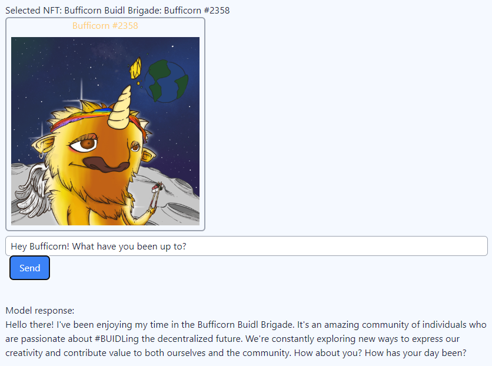

# ⚡ What is Spark ?

**/spärk/**  
*verb*

1. The process of upgrading an NFT into an NPC.  
*“Sparking my Arcadian NFT was like taking my favorite character and making it come to life”*

2. Awaken.  
*"All NFTs can be on-chain game NPCs, you just have to spark them!"*

### 🖼️ ➡️ 🤖 From NFTs to NPCs

NFTs in their current form have very limited capabilities for gameplay, as they are essentially just images with metadata. 

Sparking an NFT turns it into an NPC, providing it generative AI capabilities and making them more easily usable in on-chain games.

**Sparked NPCs** are different from the video game NPCs we are familiar with. They make use of the affordances of two technologies: blockchains and generative AI. Blockchains allow Sparked NPCs to move across games, both off and on-chain, while generative AI allows them to have agency and personality.

### Sparked NPC example

